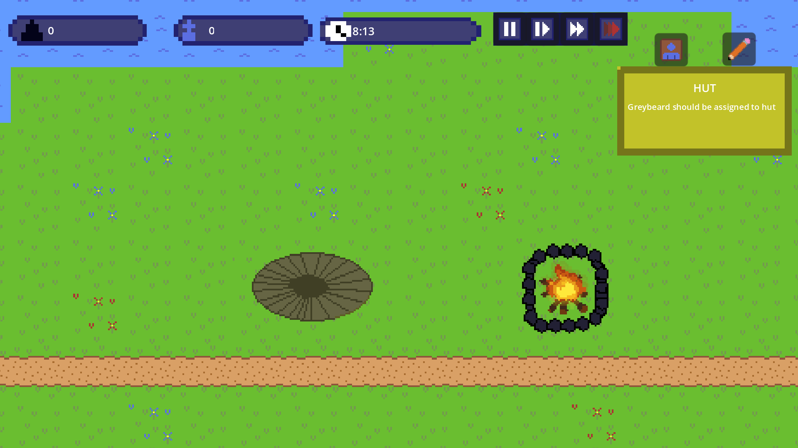
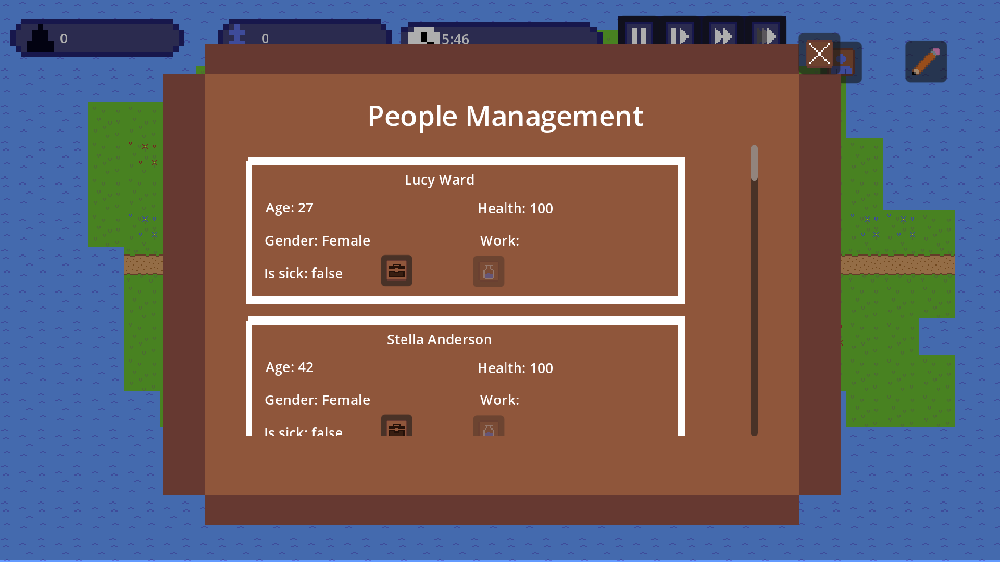
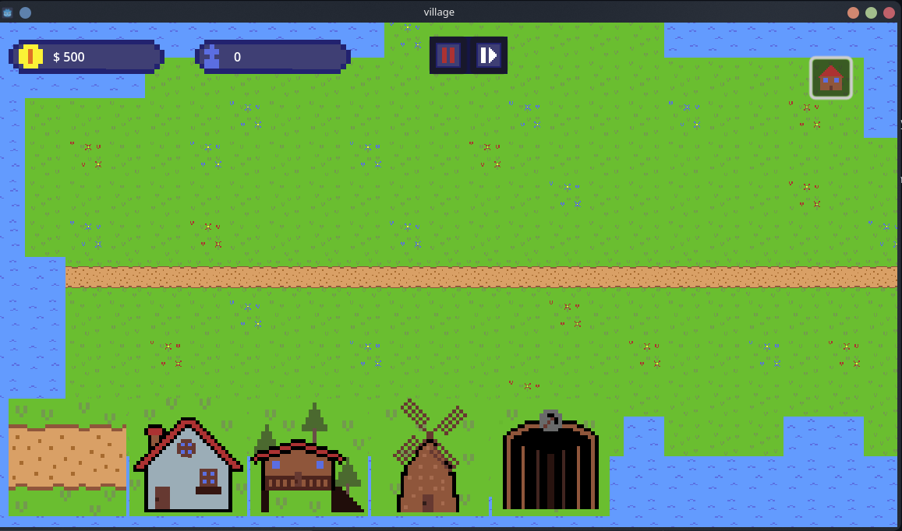

# Village

> A small game about building and developing your own settlement.  
> Actively developed.

---

## Features

- Manage every single villager
- Random events (e.g. wolf attacks)
- Tutorial system
- English and Polish translations

---

## Available Platforms

- Browser
- Windows
- Linux

---

## Screenshots

---

## Technologies Used

- **Engine:** Godot 4
- **Language:** GDScript
- **Pixel Art:** Aseprite

---

## Play the Game

Download the latest version from Itch.io:

*  [Play Village on Itch.io](https://dev-karol.itch.io/village)

---

## Contributing

Suggestions, feedback, and contributions are welcome.

If you find bugs or have ideas for improvements, feel free to open an issue.

---

## Author

Created by **Dev Karol**

- Itch.io: https://dev-karol.itch.io
- GitHub: https://github.com/Dev-Karol1111
